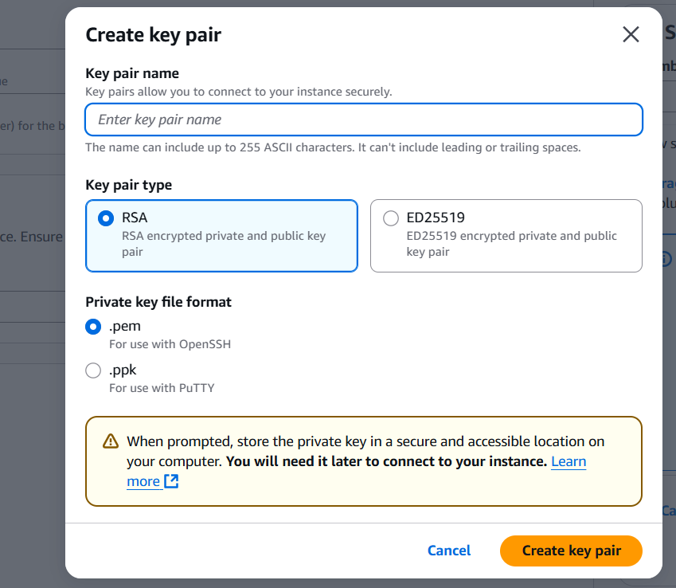
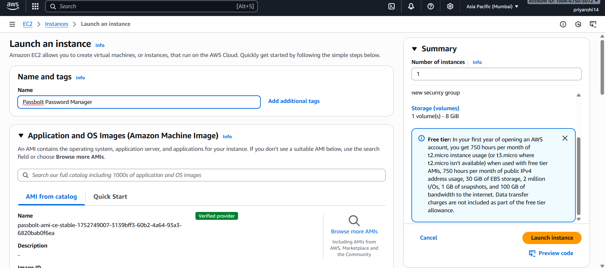
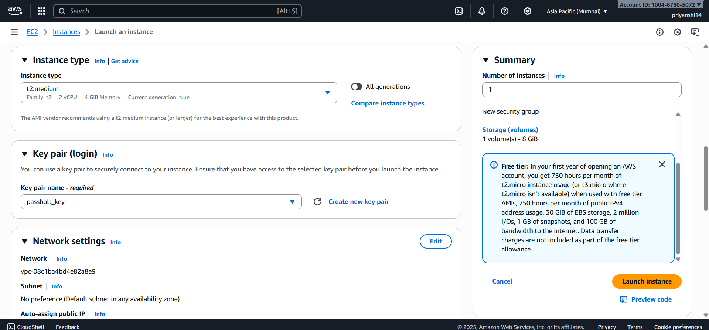
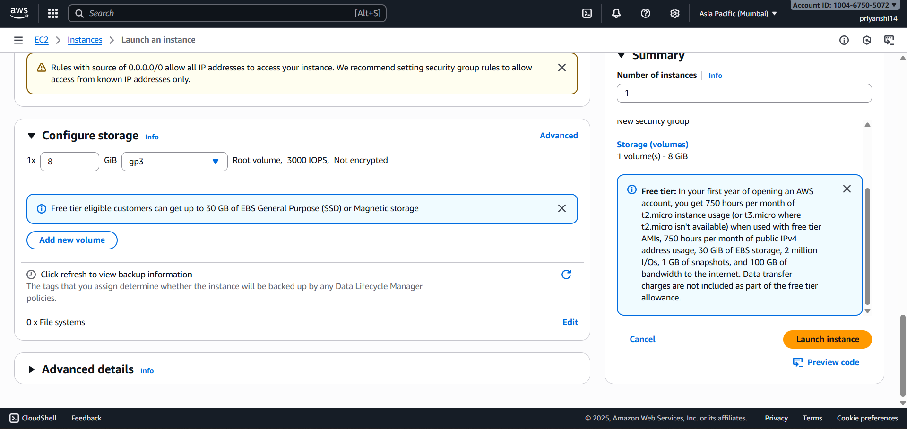
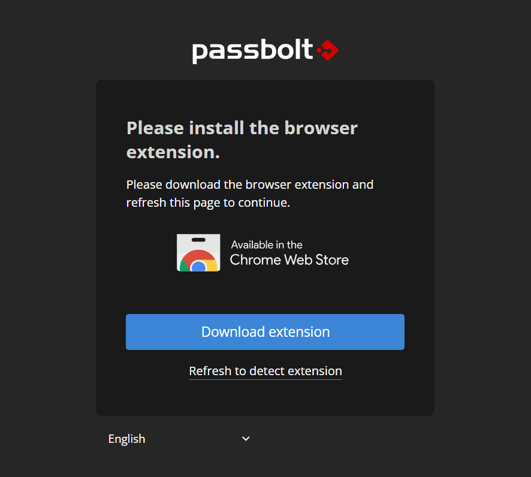
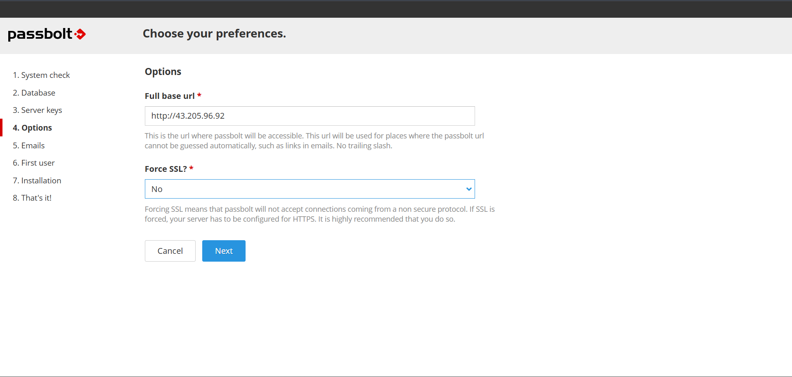
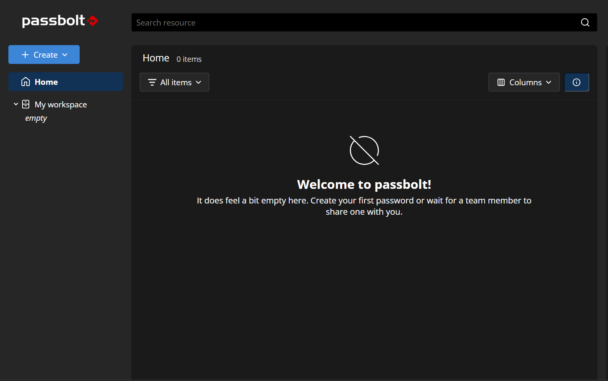
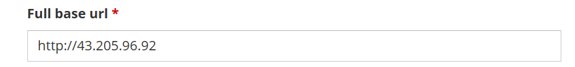
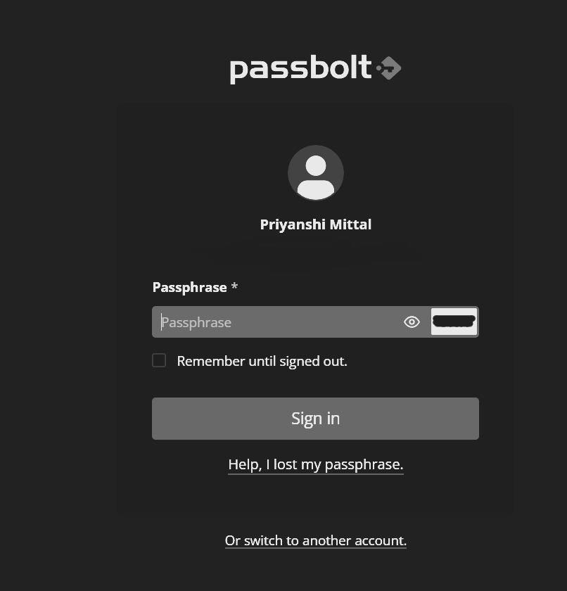

# 🚀 Passbolt Deployment on AWS  

👉 Passbolt is like a locker for your passwords, but online and for teams.
You create a Passbolt account.
You save your different website/app passwords inside it.
Instead of remembering all those passwords, you just log in once to Passbolt.
You can also share passwords securely with teammates (e.g., if everyone needs the same AWS or database password).

It works through the Chrome extension, so when you open a site, Passbolt can help you fill in the saved password.
A complete project on deploying **Passbolt (open-source password manager)** on **Amazon Web Services (AWS)**.  
This project demonstrates step-by-step deployment, from EC2 setup to configuring Passbolt, and works on **Linux, Windows, and macOS**.  

---

## 📌 Project Overview  
- 🔐 Secure password management using **Passbolt**  
- ☁️ Hosted on **AWS EC2**  
- 💻 Configurable on **Linux, Windows, or macOS**  
- 🌍 Accessible via domain/IP  

---

## 🛠️ Tech Stack  
- **Cloud**: AWS (EC2, Security Groups)  
- **Password Manager**: Passbolt  
- **Web Server**: Nginx / Apache  
- **Database**: MariaDB / MySQL  
- **OS Support**: Linux, Windows, macOS  

---

## ⚙️ Prerequisites  
Before starting, ensure you have:  
- ✅ AWS account  
- ✅ SSH key pair for EC2 instance  
- ✅ Git installed  
- ✅ Basic Linux command line knowledge  

---

## 🚀 Deployment Steps  

1️⃣ **Launch EC2 Instance**  
- Choose Ubuntu/Debian-based AMI  
- Configure security groups (allow `22`, `80`, `443`)  

2️⃣ **Install Dependencies**  
``bash
sudo apt update && sudo apt upgrade -y  
sudo apt install -y nginx mariadb-server gnupg unzip

3️⃣ Install Passbolt
Download Passbolt package
Configure database & web server
Run installation wizard

4️⃣ Access Passbolt
Visit your domain or IP:
http://<your-domain-or-ip>/
      OR
Buy a domain from namecheap 
Complete web setup (admin email & GPG keys)

## 📸 Screenshots  

### 1. AWS Setup  
- EC2 instance launched for Passbolt  
- Security group & key pair configuration  

 
 
 
 

---

### 2. AWS Setting Up & Configuring A Success
- AWS configured with all instnces.
- Created key pair using RSA

### 3. Passbolt Setup (Chrome Extension)  
- Installing Passbolt Chrome extension  
- Connecting extension with the Passbolt server  

  

---

### 4. Passbolt Configuration  
- Email verification screen  
- First-time login via extension  
- Passbolt dashboard after successful setup  

  
  

### 5. Passbolt Login
- Login Passbolt again using the purchased domain name or base url

  
  

